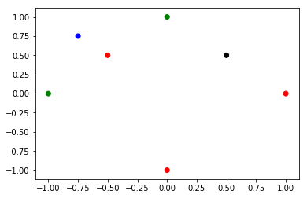
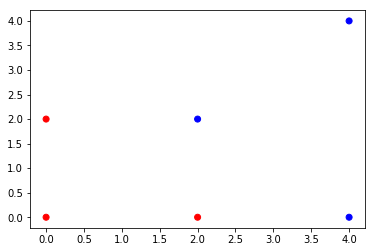

$\qquad$ $\qquad$$\qquad$  **TDA 231 Machine Learning: Home Assignment 3 -- Classification** <br />
$\qquad$ $\qquad$$\qquad$ **Goal: K-Nearest-Neighbour, Naive-bayes Classifier, Support Vector Machine, Logistic Regression**<br />
$\qquad$ $\qquad$$\qquad$                   **Grader: Yuchong, Divya** <br />
$\qquad$ $\qquad$$\qquad$                     **Due Date: 9th May** <br />
$\qquad$ $\qquad$$\qquad$                   **Submitted by: Adam Olsson, 950418-xxxx, adaolss@student.chalmers.se** <br />


---


General guidelines:
*   All solutions to theoretical and pratical problems must be submitted in this ipynb notebook, and equations wherever required, should be formatted using LaTeX math-mode.
*   All discussion regarding practical problems, along with solutions and plots should be specified in this notebook. All plots/results should be visible such that the notebook do not have to be run. But the code in the notebook should reproduce the plots/results if we choose to do so.
*   Your name, personal number and email address should be specified above.
*   All tables and other additional information should be included in this notebook.
*   **All the answers for theoretical questions must be filled in the cells created for you with "Your answer here" below each question, but feel free to add more cells if needed.**
*   Before submitting, make sure that your code can run on another computer. That all plots can show on another computer including all your writing. It is good to check if your code can run here: https://colab.research.google.com.


# Theoretical Questions
## 1. K-Nearest-Neighbour Classification (4 pts)
### 1.1 Exercise 1 (2 pts)
A KNN classifier assigns a test instance the majority class associated with its K nearest training instances. Distance between instances is measured using Euclidean distance. Suppose we have the following training set of positive (+) and negative (-) instances and a single test instance (o). All instances are projected onto a vector space of two real-valued features (X and Y). Answer the following questions. Assume “unweighted” KNN (every nearest neighbor contributes equally to the final vote).


a) What would be the class assigned to this test instance for K=1, K=3, K=5 and why? (**1 pt**)


b) What will be the maxinum value of K you think in this case? Why? (**1 pt**)

### Your answer here:

a) For K=1 and K=3 the test instance will be labled as (-) because a majority of the neighbors are from the (-) class. However, when K=5 the majority of the neighbors are from the (+) class and therefor the test instance is labled as (+).

b) The largest K value would be K=9 since this still allows the (-) class to get a majority. K=10 would also be possible but in the cases where all 5 (-) instances are neighbors to the test instance result in a 50/50 chance of a test instance being assigned to the (-) class.

### 1.2 Exercise 2 (2 pts)
Consider 5 data points:

$$\{({0},{1}), ({-1},{0})\}∈ Class1,$$ 

$$\{({1},{0}), ({0},{-1}), (-\frac{1}{2}, \frac{1}{2})\}∈ Class2.$$

Consider two test data points:

$$(-\frac{3}{4}, \frac{3}{4})∈ Class1, (\frac{1}{2}, \frac{1}{2})∈ Class2$$

Compute the probability of error based on k-nearest neighbor rule when $ K=\{1, 2, 3, 4, 5\}$ and explain why.


```python
import numpy as np
import matplotlib.pyplot as plt

x = [0,-1, 1,  0, -0.5, -0.75, 0.5]
y = [1, 0, 0, -1,  0.5,  0.75, 0.5]
label = [1, 1, -1, -1, -1, 0, 2]
colors = ['red','blue', 'green', 'black']

plt.scatter(x, y, c=label, cmap=matplotlib.colors.ListedColormap(colors))

plt.show()
```





### Your answer here:
For plot:

Train:
Green dots class 1.
Red dots class 2.

Test:
Blue dot belongs to class 1.
Black dot belongs to class 2.

K = 1: P(Blue misclassified)* P(Black misclassified) = 1 * 0.5 = 0.5
Blue dot will be misclassified because the closest neighbour belongs to other class.
Black dot will be has a 50% chance of being misclassified since it is in the middle between two points and since K = 1 it will choose at random which of the two points to consider as a neighbour. Since one of the points is same class and the other opposite class we'll have a 50/50 shot of misclassification.

K = 2: P(Blue misclassified)* P(Black misclassified) = 0.5 * 0.5 = 0.25.
Both points have an even split between the classes within their neighbours. The classifier will at random choose which class to label the test points to, thus both points have a 50/50 shot of misclassification.

K = 3: P(Blue misclassified)* P(Black misclassified) = 0 * 0 = 0.
For both points, a majority of the neighbours belongs to the same class so the classifier will label both correctly.


K = 4: P(Blue misclassified)* P(Black misclassified) = 0.5 * 0 = 0. 
The blue point have a tie between the classes within its neighbourhood and therefor it will choose at random which means a 50/50 shot of error. Additionally, for any higher K values the blue point will always be misclassified since there only are 2 points belonging to the same class as the blue point. Class 1 will never have a majority and therefor no new point will be assigned to that class. The black point has a 0 chance of misclassification since in its neighbourhood there is a majority towards its class.

K = 5: P(Blue misclassified)* P(Black misclassified) = 1 * 0 = 0. 
All points of the entire data set is now part of the classification. Since class 2 is larger than class 1, both test points will be assigned to class 2.

## 2. [Naive Bayes Classifier, 6 points]

### Exercise 1 (3 pts)
A psychologist does a small survey on ''happiness''. Each respondent provides a vector with entries 1 or 0 corresponding to if they answered “yes” or “no” to a question respectively. The question vector has attributes 
$$
x = (\mbox{rich, married, healthy}) \tag{1}
$$

Thus a response $(1, 0, 1)$ would indicate that the respondent was
''rich'', ''unmarried'' and ''healthy''. In addition, each respondent
gives a value $c = 1$ if they are content wih their life and $c = 0$
if they’re not. The following responses were obtained.

$$
c = 1: (1, 1, 1),(0, 0, 1),(1, 1, 0),(1, 0, 0) \\
c = 0: (0, 0, 0),(1, 0, 1),(0, 0, 1),(0, 1, 0)
$$

1. Using naive Bayes, what is the probability that a person is ''not rich'', ''married'' and ''healthy'' is ''content''? **(1 pt)**

2. What is the probability that a person who is ''not rich'' and ''married'' is content ? (i.e. we do not know if they are ''healthy'') **(2 pts)**


### Your answer here:

|     isRich  |  C | NC| P(C)|P(NC)|
|-------------|----|---|-----|-----|
| 0           | 1  | 3 | 1/4 | 3/4 |
| 1           | 3  | 1 | 3/4 | 1/4 |

|  isMarried  |  C | NC| P(C)|P(NC)|
|-------------|----|---|-----|-----|
| 0           | 2  | 3 | 2/4 | 3/4 |
| 1           | 2  | 1 | 2/4 | 1/4 |

|isHealthy | C| NC | P(C) | P(NC) |
|:-------|-:|---:|-----:|------:| 
|0       | 2|   2|   2/4|    2/4|
|1       | 2|   2|   2/4|    2/4|

|  isContent  |  amount | P( )|
|-------------|---------|----|
| No          | 4       | 4/8|
| Yes         | 4       | 4/8|

The probabilites was found by looking at how likely each feature was in relation to the other features in the training data. 

1) 

$$P(c=1 | (0,1,1)) = P(c=1 | rich=0)P(c=1 | married=1)P(c=1 | healthy=1)P(c=1) = $$ 
$$\frac{1}{4}*\frac{1}{2}*\frac{1}{2}*\frac{1}{2} = \frac{1}{32}$$

$$P(c=0 | (0,1,1)) = \frac{3}{4}*\frac{1}{4}*\frac{1}{2}*\frac{1}{2} = \frac{3}{64}$$

$$ P(c=1 | (0,1,1)) = \frac{\frac{1}{32}}{\frac{1}{32}+ \frac{3}{64}} = 0.4 = 40\%$$

2) 

$$P(c = 1 | (0,1,0)) + P(c = 1 | (0,1,1)) = \frac{1}{4}\frac{1}{2}\frac{1}{2}\frac{1}{2} + \frac{1}{4}\frac{1}{2}\frac{1}{2}\frac{1}{2} = \frac{2}{32}$$

$$P(c = 0 | (0,1,0)) + P(c = 0 | (0,1,1)) = \frac{3}{4}\frac{1}{4}\frac{1}{2}\frac{1}{2} + \frac{3}{4}\frac{1}{4}\frac{1}{2}\frac{1}{2} = \frac{6}{64}$$

$$P(c=1 | (rich=0, married=1)) = \frac{\frac{2}{32}}{\frac{2}{32} + \frac{6}{64}} = 0.4 = 40\%$$


### Exercise  2 (3 pts)
We now consider real valued data i.e. $x \in \mathbb{R}^2$.
#### a. (1 pt)
Assume that the class conditional density is **spherical** Gaussian, and both classes have equal fixed prior i.e. $p(y= \pm 1) = 0.5$. Write the expression for the **naive Bayes** classifier i.e. derive
$$
P(y_{new} = -1 | x_{new} , X, y ) \\ \tag{1}
P(y_{new} = +1 | x_{new} , X, y ) ~.
$$

It is useful to note that the dependence on training data $X, y$ for class $i$ can be expressed as: 

$$ 
P( x_{new} | y_{new} = 1, X, y) = P(x_{new} |
\mu_{i}, \sigma^{2}_{i})
$$

where $\mu_{i} \in \mathbb{R}^2$ and $\sigma^{2}_{i}\in \mathbb{R}$.

***Hint***: Derive the expressions of MLE for parameters in terms of training-data. Then express eq.1 in terms of those estimates. 

#### b. (2 pts)
Derive the MLE expression for parameters when the covariance matrix is not diagonal, i.e, Covariance matrix has 4 unknown parameters. This is done to alleviate "naive" assumption, since now feature components are no longer independent.

### Your answer here:
A)

$$ln(L) = \prod^{N_{c}}N(\mu_{c}, \Sigma_{c}) = $$

$$ \sum^{N_{c}}_{n=1}ln(\frac{1}{(2*\pi)^{\frac{D}{2}}|\Sigma_{c}|^{\frac{1}{2}}}\exp(-\frac{1}{2}(X_{n}-\mu_{c})^T\Sigma^{-1}_{c}(X_{n}-\mu_{c})))$$

Removing constants that will disappear in derivate:

$$N_{c}ln(\frac{1}{|\Sigma_{c}|^{\frac{1}{2}}}) - \frac{1}{2}\sum^{N_{c}}_{n=1}(X_{n}-\mu_{c})^T\Sigma^{-1}_{c}(X_{n}-\mu_{c}) = $$

$$\frac{N_{c}}{2}ln(|\Sigma_{c}|^{-1}) - \frac{1}{2}\sum^{N_{c}}_{n=1}(X_{n}-\mu_{c})^T\Sigma^{-1}_{c}(X_{n}-\mu_{c})$$

Using the following rules and trace we can rewrite as:

(1) trace(a) = a if a is single value

(2) trace(AB) = trace(BA)

$$\frac{N_{c}}{2}ln(|\Sigma_{c}|^{-1}) - \frac{1}{2}\sum^{N_{c}}_{n=1}trace((X_{n}-\mu_{c})^T\Sigma^{-1}_{c}(X_{n}-\mu_{c})) = $$

$$\frac{N_{c}}{2}ln(|\Sigma_{c}|^{-1}) - \frac{1}{2}\sum^{N_{c}}_{n=1}trace((X_{n}-\mu_{c})^T(X_{n}-\mu_{c})\Sigma^{-1}_{c}) $$

Taking the derivative w.r.t $\Sigma^{-1}_{c}:$
$$\frac{\partial ln(L)}{\partial \Sigma^{-1}_{c}} = \frac{N_{c}}{2}\Sigma_{c}^{--T} - \frac{1}{2}\sum^{N_{c}}_{n=1}((X_{n}-\mu_{c})^T(X_{n}-\mu_{c}))^{T} = $$

$$ \frac{N_{c}}{2}\Sigma_{c} - \frac{1}{2}\sum^{N_{c}}_{n=1}(X_{n}-\mu_{c})(X_{n}-\mu_{c})^T $$

Solving for $\Sigma_{c} = 0$:

$$\frac{N_{c}}{2}\Sigma_{c} - \frac{1}{2}\sum^{N_{c}}_{n=1}(X_{n}-\mu_{c})(X_{n}-\mu_{c})^T  = 0$$

$$N_{c}\Sigma_{c} = \sum^{N_{c}}_{n=1}(X_{n}-\mu_{c})(X_{n}-\mu_{c})^T$$

$$\Sigma_{c} = \frac{1}{N_{c}}\sum^{N_{c}}_{n=1}(X_{n}-\mu_{c})(X_{n}-\mu_{c})^T $$

When solving for $\mu$ we'll do a tiny change to our loglikelihood function:

$$\frac{N_{c}}{2}ln(|\Sigma_{c}|^{-1}) - \frac{1}{2}\sum^{N_{c}}_{n=1}(X_{n}-\mu_{c})^T\Sigma^{-1}_{c}(X_{n}-\mu_{c}) = $$

$$-\frac{N_{c}}{2}ln(|\Sigma_{c}|) - \frac{1}{2}\sum^{N_{c}}_{n=1}(X_{n}-\mu_{c})^T\Sigma^{-1}_{c}(X_{n}-\mu_{c})$$

Now taking the derivative w.r.t $\mu_{c}$: (using the rule $\frac{\partial w^TAw}{\partial w} = 2Aw$)


$$\frac{\partial ln(L)}{\partial \mu_{c}} = -\frac{1}{2}\sum^{N_{c}}_{n=1}2\Sigma^{-1}_{c}(X_{n}-\mu_{c}) = $$

$$ \sum^{N_{c}}_{n=1}\Sigma^{-1}_{c}(\mu_{c}-X_{n}) $$

Because $\Sigma^{-1}_{c}$ is positive definite:

$$ \sum^{N_{c}}_{n=1}\Sigma^{-1}_{c}(\mu_{c}-X_{n}) = $$
$$ \frac{\partial ln(L)}{\partial \mu_{c}} = \sum^{N_{c}}_{n=1}(\mu_{c}-X_{n}) $$

Now finally solving for $\mu_{c} = 0$:

$$ \sum^{N_{c}}_{n=1}(\mu_{c}-X_{n})  = 0$$
$$ N_{c}\mu_{c}-\sum^{N_{c}}_{n=1}X_{n}  = 0$$
$$ \mu_{c}= \frac{1}{N_{c}}\sum^{N_{c}}_{n=1}X_{n}$$

So back to the task:

$$P(T_{new} = c | x_{new}, X, t) = \frac{p(x_{new}|T_{new}=c,X,t)P(T_{new}=c|X,t)}{\sum^{C}_{c'=1}p(x_{new}|T_{new}=c',X,t)P(T_{new}=c'|X,t)}$$

$$P(T_{new}=c|X,t) = 0.5 $$

$$P(T_{new} = c | x_{new}, X, t) = \frac{p(x_{new}|T_{new}=c,X,t)0.5}{p(x_{new}|T_{new}=-1,X,t)0.5 + p(x_{new}|T_{new}=1,X,t)0.5} = $$

$$ P(T_{new} = c | x_{new}, X, t) = \frac{p(x_{new}|T_{new}=c,X,t)}{p(x_{new}|T_{new}=-1,X,t) + p(x_{new}|T_{new}=1,X,t)}$$

Where: 
$$p(x_{new}|T_{new}=c,X,t) = N(\mu_{c}, \Sigma_{c})$$
$$ \mu_{c}= \frac{1}{N_{c}}\sum^{N_{c}}_{n=1}X_{n}$$
$$\Sigma_{c} = \frac{1}{N_{c}}\sum^{N_{c}}_{n=1}(X_{n}-\mu_{c})(X_{n}-\mu_{c})^T $$

B)

## 3. [SVM, 5 points]

### a (2 pts)

Consider a (hard margin) SVM with the following training points from
two classes:
\begin{eqnarray}
+1: &(2,2), (4,4), (4,0) \nonumber \\
-1: &(0,0), (2,0), (0,2) \nonumber
\end{eqnarray}

1. Plot these six training points, and construct, by inspection, the
weight vector for the optimal hyperplane. **(1 pt)**

2. In your solution, specify the hyperplane in terms of w and b such that $w_1 x_1 + w_2 x_2 + b =0$. Calculate the margin, i.e. $2\gamma$, where $\gamma$ is the
distance from the hyperplane to its closest data point. (Hint: It may be useful to recall that the distance of a point $(a_1,a_2)$ from the line $w_1x_1 + w_2x_2 + b = 0$ is $|w_1a_1 + w_2a_2 + b|/\sqrt{w_1^2 + w_2^2}$.) **(1 pt)**

### b (3 pts)

Consider the same problem from above.

1. Write the primal formulation of the SVM **for this specific example** i.e. you have to specialise the general formulation for the set of inputs given. **(1 pt)**

2. Write the dual formulation **for this specific**. Give the optimal dual solution, comment on support vectors. **(2 pts)**


```python
import numpy as np
import matplotlib.pyplot as plt

x = [2,4,4,0,2,0]
y = [2,4,0,0,0,2]
label = [1, 1, 1, -1, -1, -1]
colors = ['red','blue']
#plt.legend(label)

plt.scatter(x, y, c=label, cmap=matplotlib.colors.ListedColormap(colors))

plt.show()
```





### Your answer here:
A)
1) w1 = 1, w2 = 1

2) For the line equation we'll use two points (1,2) and (3,0) which are in the middle between support vectors:
$$ P = (1,2) ; Q = (3,0)$$
$$(2-0)x_{1} + (3-1)x_{2} + (1*0 - 3*2) = 2x_{1} + 2x_{2} - 6 = x_{1} + x_{2} - 3 = 0$$

Here we also confirm our weight vector $w_{1} = 1$ and $w_{2} = 1$ we visually defined in 1)

Using points (0,2), (2,0), (2,2) and (4,0):

$$\gamma = \frac{|x_{1}w_{1} + x_{2}w_{2} +b|}{\sqrt{w_{1}^2 + w_{2}^2}}$$

$$\gamma = \frac{0 + 2 - 3}{\sqrt{2}} = \frac{1}{\sqrt{2}}$$
$$\gamma = \frac{2 + 0 - 3}{\sqrt{2}} = \frac{1}{\sqrt{2}}$$
$$\gamma = \frac{2 + 2 - 3}{\sqrt{2}} = \frac{1}{\sqrt{2}}$$
$$\gamma = \frac{4 + 0 - 3}{\sqrt{2}} = \frac{1}{\sqrt{2}}$$

$$ \gamma =  \frac{1}{\sqrt{2}} $$
$$ 2\gamma =  \frac{2}{\sqrt{2}} =  \sqrt{2}$$

B)
Primal:
$$argmin_{w} \frac{1}{2}||w||^2 $$
subject to $$ t_{n}(w^Tx_{n} + b) \ge 1  \forall n$$
Making it specific for our problem:

$$argmin_{w} \frac{1}{2}||w||^2 $$
Subject to: 
$$1(2w_{1} + 2w_{2} + b) \ge 1$$
$$1(4w_{1} + 4w_{2} + b) \ge 1$$
$$1(4w_{1} + b) \ge 1$$
$$-1(b) \ge 1$$
$$-1(2w_{1} + b) \ge 1$$
$$-1(2w_{2} + b) \ge 1$$

# Practical Question
## 4. Logistic Regression (5 pts)
### Customer churn with Logistic Regression
A telecommunications company is concerned about the number of customers leaving their land-line business for cable competitors. They need to understand who is leaving. Imagine that you are an analyst at this company and you have to find out who is leaving and why.

### About the dataset

We will use a telecommunications dataset for predicting customer churn. This is a historical customer dataset where each row represents one customer. The data is relatively easy to understand, and you may uncover insights you can use immediately. Typically it is less expensive to keep customers than acquire new ones, so the focus of this analysis is to predict the customers who will stay with the company.
This data set provides information to help you predict what behavior will help you to retain customers. You can analyse all relevant customer data and develop focused customer retention programs.
The dataset includes information about:
*   Customers who left within the last month – the column is called Churn.
*   Services that each customer has signed up for – phone, multiple lines, internet, online security, online backup, device protection, tech support, and streaming TV and movies.
*   Customer account information – how long they had been a customer, contract, payment method, paperless billing, monthly charges, and total charges.
*   Demographic info about customers – gender, age range, and if they have partners and dependents.
We will help you load and visualise the dataset as well as the preprocessing, you need to build up your logistic regression model step by step and do the prediction.
*   **Remember, you are not allowed to use sklearn in modelling and predicting, you have to fill your code in the skeleton.** 


```python
## Load the dataset and read it
import pandas as pd
import pylab as pl
import numpy as np
import scipy.optimize as opt
from sklearn import preprocessing
import urllib

try:
    urllib.request.urlretrieve('https://raw.githubusercontent.com/BruceZHANG6/Imagesforuse/master/ChurnData.csv', 'ChurnData.csv')
except urllib.error.HTTPError as ex:
    print('Problem:', ex)
    
churn_df = pd.read_csv("ChurnData.csv")
churn_df.head()
```


<div>
<style scoped>
    .dataframe tbody tr th:only-of-type {
        vertical-align: middle;
    }

    .dataframe tbody tr th {
        vertical-align: top;
    }

    .dataframe thead th {
        text-align: right;
    }
</style>
<table border="1" class="dataframe">
  <thead>
    <tr style="text-align: right;">
      <th></th>
      <th>tenure</th>
      <th>age</th>
      <th>address</th>
      <th>income</th>
      <th>ed</th>
      <th>employ</th>
      <th>equip</th>
      <th>callcard</th>
      <th>wireless</th>
      <th>longmon</th>
      <th>...</th>
      <th>pager</th>
      <th>internet</th>
      <th>callwait</th>
      <th>confer</th>
      <th>ebill</th>
      <th>loglong</th>
      <th>logtoll</th>
      <th>lninc</th>
      <th>custcat</th>
      <th>churn</th>
    </tr>
  </thead>
  <tbody>
    <tr>
      <th>0</th>
      <td>11.0</td>
      <td>33.0</td>
      <td>7.0</td>
      <td>136.0</td>
      <td>5.0</td>
      <td>5.0</td>
      <td>0.0</td>
      <td>1.0</td>
      <td>1.0</td>
      <td>4.40</td>
      <td>...</td>
      <td>1.0</td>
      <td>0.0</td>
      <td>1.0</td>
      <td>1.0</td>
      <td>0.0</td>
      <td>1.482</td>
      <td>3.033</td>
      <td>4.913</td>
      <td>4.0</td>
      <td>1.0</td>
    </tr>
    <tr>
      <th>1</th>
      <td>33.0</td>
      <td>33.0</td>
      <td>12.0</td>
      <td>33.0</td>
      <td>2.0</td>
      <td>0.0</td>
      <td>0.0</td>
      <td>0.0</td>
      <td>0.0</td>
      <td>9.45</td>
      <td>...</td>
      <td>0.0</td>
      <td>0.0</td>
      <td>0.0</td>
      <td>0.0</td>
      <td>0.0</td>
      <td>2.246</td>
      <td>3.240</td>
      <td>3.497</td>
      <td>1.0</td>
      <td>1.0</td>
    </tr>
    <tr>
      <th>2</th>
      <td>23.0</td>
      <td>30.0</td>
      <td>9.0</td>
      <td>30.0</td>
      <td>1.0</td>
      <td>2.0</td>
      <td>0.0</td>
      <td>0.0</td>
      <td>0.0</td>
      <td>6.30</td>
      <td>...</td>
      <td>0.0</td>
      <td>0.0</td>
      <td>0.0</td>
      <td>1.0</td>
      <td>0.0</td>
      <td>1.841</td>
      <td>3.240</td>
      <td>3.401</td>
      <td>3.0</td>
      <td>0.0</td>
    </tr>
    <tr>
      <th>3</th>
      <td>38.0</td>
      <td>35.0</td>
      <td>5.0</td>
      <td>76.0</td>
      <td>2.0</td>
      <td>10.0</td>
      <td>1.0</td>
      <td>1.0</td>
      <td>1.0</td>
      <td>6.05</td>
      <td>...</td>
      <td>1.0</td>
      <td>1.0</td>
      <td>1.0</td>
      <td>1.0</td>
      <td>1.0</td>
      <td>1.800</td>
      <td>3.807</td>
      <td>4.331</td>
      <td>4.0</td>
      <td>0.0</td>
    </tr>
    <tr>
      <th>4</th>
      <td>7.0</td>
      <td>35.0</td>
      <td>14.0</td>
      <td>80.0</td>
      <td>2.0</td>
      <td>15.0</td>
      <td>0.0</td>
      <td>1.0</td>
      <td>0.0</td>
      <td>7.10</td>
      <td>...</td>
      <td>0.0</td>
      <td>0.0</td>
      <td>1.0</td>
      <td>1.0</td>
      <td>0.0</td>
      <td>1.960</td>
      <td>3.091</td>
      <td>4.382</td>
      <td>3.0</td>
      <td>0.0</td>
    </tr>
  </tbody>
</table>
<p>5 rows × 28 columns</p>
</div>


```python
## Data pre-processing and selection
## Train/Test dataset split
churn_df = churn_df[['tenure', 'age', 'address', 'income', 'ed', 'employ', 'equip',   'callcard', 'wireless','churn']]
churn_df['churn'] = churn_df['churn'].astype('int')
churn_df.head()

X = np.asarray(churn_df[['tenure', 'age', 'address', 'income', 'ed', 'employ', 'equip']])
y = np.asarray(churn_df['churn'])
y = np.reshape(y, (np.asarray(churn_df['churn']).shape[0], 1))
X = preprocessing.StandardScaler().fit(X).transform(X)
from sklearn.model_selection import train_test_split
X_train, X_test, y_train, y_test = train_test_split( X, y, test_size=0.2, random_state=4)
X_train=X_train.T
X_test=X_test.T
y_train=y_train.T
y_test=y_test.T
print ('Train set:', X_train.shape,  y_train.shape)
print ('Test set:', X_test.shape,  y_test.shape)
```

    Train set: (7, 160) (1, 160)
    Test set: (7, 40) (1, 40)


**Hints**:
- You compute $sigmoid( w^T x + b) = \frac{1}{1 + e^{-(w^T x + b)}}$ .
- You compute activation $A = \sigma(w^T X + b) = (a^{(0)}, a^{(1)}, ..., a^{(m-1)}, a^{(m)})$.
- You calculate the cost function: $J = -\frac{1}{m}\sum_{i=1}^{m}y^{(i)}\log(a^{(i)})+(1-y^{(i)})\log(1-a^{(i)})$.

Here are the two formulas you will be using: 

$$ \frac{\partial J}{\partial w} = \frac{1}{m}X(A-Y)^T$$
$$ \frac{\partial J}{\partial b} = \frac{1}{m} \sum_{i=1}^m (a^{(i)}-y^{(i)})$$

- You write down the optimization function. The goal is to learn $w$ and $b$ by minimizing the cost function $J$. For a parameter $\theta$, the update rule is $ \theta = \theta - \alpha \text{ } d\theta$, where $\alpha$ is the learning rate.
- In prediction, you calculate $\hat{Y} = A = \sigma(w^T X + b)$.
- You may use np.exp, np.log(), np.dot(), etc. 


```python
## Modeling and predicting

# GRADED FUNCTION: sigmoid
def sigmoid(z):
    """
    Return: s -- sigmoid(z)
    """
    s = 1/(1+ np.exp(-z)) # Your code here
    
    return s
  
# GRADED FUNCTION: initialize_with_zeros
def initialize_with_zeros(dim):
    """
    Returns:
    w -- initialized vector of shape (dim, 1)
    b -- initialized to 0
    """    
    w = np.zeros((dim, 1)) # Your code here
    b = 0 # Your code here
   
    assert(w.shape == (dim,1))
    assert(isinstance(b, float) or isinstance(b, int))
    
    return w, b
  
# GRADED FUNCTION: grad_cost
def grad_cost(w, b, X, Y):
    """
    Arguments:
    X -- data of size (number of features, number of examples)
    Y -- true "label" vector

    Return:
    cost -- negative log-likelihood cost for logistic regression
    dw -- gradient of the loss with respect to w, thus same shape as w
    db -- gradient of the loss with respect to b, thus same shape as b
    """ 
    m = X.shape[1]
    
    A    = sigmoid(np.dot(np.transpose(w), X) +b) # Your code here
    cost = -1/m * sum(Y[0,i] * np.log(A[0,i]) + (1-Y[0,i]) * np.log(1 - A[0,i]) for i in range(m)) # Your code here
    dw   =  1/m * np.dot(X, np.transpose(A-Y)) # Your code here
    db   =  1/m * sum(A[0,i] - Y[0,i] for i in range(m)) # Your code here
    
    assert(dw.shape == w.shape)
    assert(db.dtype == float)
    cost = np.squeeze(cost)
    assert(cost.shape == ())
    
    grads = {"dw": dw,
             "db": db}
    
    return grads, cost

 # GRADED FUNCTION: optimize
def optimize(w, b, X, Y, num_iterations, learning_rate, print_cost = False):
    """
    This function optimizes w and b by running a gradient descent algorithm
    """
    costs = []
    
    for i in range(num_iterations):
        
        grads, cost = grad_cost(w,b,X,Y)
        dw = grads["dw"]
        db = grads["db"]
        
        # update rule
        w = w - learning_rate*dw # Your code here
        b = b - learning_rate*db # Your code here
        
        if i % 100 == 0:
            costs.append(cost)     
        if print_cost and i % 100 == 0:
            print ("Cost after iteration %i: %f" %(i, cost))
    
    params = {"w": w,
              "b": b}   
    grads = {"dw": dw,
             "db": db}
    
    return params, grads, costs
  
# GRADED FUNCTION: predict
def predict(w, b, X):
    '''
    Returns:
    Y_prediction -- a numpy array (vector) containing all predictions (0/1) for the examples in X
    '''    
    m = X.shape[1]
    Y_prediction = np.zeros((1,m))
    w = w.reshape(X.shape[0], 1)
    
    # Compute vector "A" predicting the probabilities of a cat being present in the picture
    A = sigmoid(np.dot(np.transpose(w), X) + b) # Your code here
    
    for i in range(A.shape[1]):
        
        if A[0,i]<=0.5:
            Y_prediction[0,i]=0;
        if A[0,i]>0.5:
            Y_prediction[0,i]=1
    
    assert(Y_prediction.shape == (1, m))
    
    return Y_prediction
  
# GRADED FUNCTION: model
def model(X_train, Y_train, X_test, Y_test, num_iterations = 2000, learning_rate = 0.5, print_cost = False):
    """
    Builds the logistic regression model by calling the function you've implemented previously
    Returns: d -- dictionary containing information about the model.
    """    
    # initialize parameters with zeros
    w, b = initialize_with_zeros(X_train.shape[0]) #Your code here

    # Gradient descent
    parameters, grads, costs = optimize(w, b, X_train, Y_train, num_iterations, learning_rate, print_cost) #Your code here
    
    w = parameters["w"]
    b = parameters["b"]
    
    Y_prediction_test = predict(w,b,X_test)
    Y_prediction_train = predict(w,b,X_train)

    print("train accuracy: {} %".format(100 - np.mean(np.abs(Y_prediction_train - Y_train)) * 100))
    print("test accuracy: {} %".format(100 - np.mean(np.abs(Y_prediction_test - Y_test)) * 100))
   
    d = {"costs": costs,
         "Y_prediction_test": Y_prediction_test, 
         "Y_prediction_train" : Y_prediction_train, 
         "w" : w, 
         "b" : b,
         "learning_rate" : learning_rate,
         "num_iterations": num_iterations}
    
    return d
```


```python
## The train accuracy and test accuracy
## Feel free to change the hyperparameters
d = model(X_train, y_train, X_test, y_test, num_iterations = 20000, learning_rate = 0.005, print_cost = True)
```

    Cost after iteration 0: 0.693147
    Cost after iteration 100: 0.630203
    Cost after iteration 200: 0.590523
    Cost after iteration 300: 0.563211
    Cost after iteration 400: 0.543095
    Cost after iteration 500: 0.527566
    Cost after iteration 600: 0.515188
    Cost after iteration 700: 0.505098
    Cost after iteration 800: 0.496739
    Cost after iteration 900: 0.489725
    Cost after iteration 1000: 0.483781
    Cost after iteration 1100: 0.478702
    Cost after iteration 1200: 0.474330
    Cost after iteration 1300: 0.470543
    Cost after iteration 1400: 0.467245
    Cost after iteration 1500: 0.464357
    Cost after iteration 1600: 0.461818
    Cost after iteration 1700: 0.459574
    Cost after iteration 1800: 0.457585
    Cost after iteration 1900: 0.455815
    Cost after iteration 2000: 0.454234
    Cost after iteration 2100: 0.452818
    Cost after iteration 2200: 0.451546
    Cost after iteration 2300: 0.450401
    Cost after iteration 2400: 0.449367
    Cost after iteration 2500: 0.448431
    Cost after iteration 2600: 0.447583
    Cost after iteration 2700: 0.446812
    Cost after iteration 2800: 0.446110
    Cost after iteration 2900: 0.445470
    Cost after iteration 3000: 0.444886
    Cost after iteration 3100: 0.444351
    Cost after iteration 3200: 0.443862
    Cost after iteration 3300: 0.443413
    Cost after iteration 3400: 0.443000
    Cost after iteration 3500: 0.442621
    Cost after iteration 3600: 0.442272
    Cost after iteration 3700: 0.441950
    Cost after iteration 3800: 0.441654
    Cost after iteration 3900: 0.441380
    Cost after iteration 4000: 0.441127
    Cost after iteration 4100: 0.440893
    Cost after iteration 4200: 0.440676
    Cost after iteration 4300: 0.440475
    Cost after iteration 4400: 0.440289
    Cost after iteration 4500: 0.440117
    Cost after iteration 4600: 0.439957
    Cost after iteration 4700: 0.439808
    Cost after iteration 4800: 0.439670
    Cost after iteration 4900: 0.439541
    Cost after iteration 5000: 0.439422
    Cost after iteration 5100: 0.439310
    Cost after iteration 5200: 0.439207
    Cost after iteration 5300: 0.439110
    Cost after iteration 5400: 0.439020
    Cost after iteration 5500: 0.438936
    Cost after iteration 5600: 0.438858
    Cost after iteration 5700: 0.438785
    Cost after iteration 5800: 0.438717
    Cost after iteration 5900: 0.438653
    Cost after iteration 6000: 0.438593
    Cost after iteration 6100: 0.438538
    Cost after iteration 6200: 0.438486
    Cost after iteration 6300: 0.438437
    Cost after iteration 6400: 0.438392
    Cost after iteration 6500: 0.438349
    Cost after iteration 6600: 0.438309
    Cost after iteration 6700: 0.438272
    Cost after iteration 6800: 0.438237
    Cost after iteration 6900: 0.438204
    Cost after iteration 7000: 0.438173
    Cost after iteration 7100: 0.438144
    Cost after iteration 7200: 0.438118
    Cost after iteration 7300: 0.438092
    Cost after iteration 7400: 0.438068
    Cost after iteration 7500: 0.438046
    Cost after iteration 7600: 0.438025
    Cost after iteration 7700: 0.438006
    Cost after iteration 7800: 0.437987
    Cost after iteration 7900: 0.437970
    Cost after iteration 8000: 0.437954
    Cost after iteration 8100: 0.437939
    Cost after iteration 8200: 0.437924
    Cost after iteration 8300: 0.437911
    Cost after iteration 8400: 0.437898
    Cost after iteration 8500: 0.437886
    Cost after iteration 8600: 0.437875
    Cost after iteration 8700: 0.437865
    Cost after iteration 8800: 0.437855
    Cost after iteration 8900: 0.437845
    Cost after iteration 9000: 0.437837
    Cost after iteration 9100: 0.437828
    Cost after iteration 9200: 0.437821
    Cost after iteration 9300: 0.437813
    Cost after iteration 9400: 0.437807
    Cost after iteration 9500: 0.437800
    Cost after iteration 9600: 0.437794
    Cost after iteration 9700: 0.437788
    Cost after iteration 9800: 0.437783
    Cost after iteration 9900: 0.437778
    Cost after iteration 10000: 0.437773
    Cost after iteration 10100: 0.437769
    Cost after iteration 10200: 0.437765
    Cost after iteration 10300: 0.437761
    Cost after iteration 10400: 0.437757
    Cost after iteration 10500: 0.437753
    Cost after iteration 10600: 0.437750
    Cost after iteration 10700: 0.437747
    Cost after iteration 10800: 0.437744
    Cost after iteration 10900: 0.437741
    Cost after iteration 11000: 0.437739
    Cost after iteration 11100: 0.437736
    Cost after iteration 11200: 0.437734
    Cost after iteration 11300: 0.437732
    Cost after iteration 11400: 0.437729
    Cost after iteration 11500: 0.437728
    Cost after iteration 11600: 0.437726
    Cost after iteration 11700: 0.437724
    Cost after iteration 11800: 0.437722
    Cost after iteration 11900: 0.437721
    Cost after iteration 12000: 0.437719
    Cost after iteration 12100: 0.437718
    Cost after iteration 12200: 0.437717
    Cost after iteration 12300: 0.437715
    Cost after iteration 12400: 0.437714
    Cost after iteration 12500: 0.437713
    Cost after iteration 12600: 0.437712
    Cost after iteration 12700: 0.437711
    Cost after iteration 12800: 0.437710
    Cost after iteration 12900: 0.437709
    Cost after iteration 13000: 0.437709
    Cost after iteration 13100: 0.437708
    Cost after iteration 13200: 0.437707
    Cost after iteration 13300: 0.437706
    Cost after iteration 13400: 0.437706
    Cost after iteration 13500: 0.437705
    Cost after iteration 13600: 0.437705
    Cost after iteration 13700: 0.437704
    Cost after iteration 13800: 0.437704
    Cost after iteration 13900: 0.437703
    Cost after iteration 14000: 0.437703
    Cost after iteration 14100: 0.437702
    Cost after iteration 14200: 0.437702
    Cost after iteration 14300: 0.437701
    Cost after iteration 14400: 0.437701
    Cost after iteration 14500: 0.437701
    Cost after iteration 14600: 0.437700
    Cost after iteration 14700: 0.437700
    Cost after iteration 14800: 0.437700
    Cost after iteration 14900: 0.437699
    Cost after iteration 15000: 0.437699
    Cost after iteration 15100: 0.437699
    Cost after iteration 15200: 0.437699
    Cost after iteration 15300: 0.437699
    Cost after iteration 15400: 0.437698
    Cost after iteration 15500: 0.437698
    Cost after iteration 15600: 0.437698
    Cost after iteration 15700: 0.437698
    Cost after iteration 15800: 0.437698
    Cost after iteration 15900: 0.437697
    Cost after iteration 16000: 0.437697
    Cost after iteration 16100: 0.437697
    Cost after iteration 16200: 0.437697
    Cost after iteration 16300: 0.437697
    Cost after iteration 16400: 0.437697
    Cost after iteration 16500: 0.437697
    Cost after iteration 16600: 0.437697
    Cost after iteration 16700: 0.437696
    Cost after iteration 16800: 0.437696
    Cost after iteration 16900: 0.437696
    Cost after iteration 17000: 0.437696
    Cost after iteration 17100: 0.437696
    Cost after iteration 17200: 0.437696
    Cost after iteration 17300: 0.437696
    Cost after iteration 17400: 0.437696
    Cost after iteration 17500: 0.437696
    Cost after iteration 17600: 0.437696
    Cost after iteration 17700: 0.437696
    Cost after iteration 17800: 0.437696
    Cost after iteration 17900: 0.437696
    Cost after iteration 18000: 0.437696
    Cost after iteration 18100: 0.437696
    Cost after iteration 18200: 0.437695
    Cost after iteration 18300: 0.437695
    Cost after iteration 18400: 0.437695
    Cost after iteration 18500: 0.437695
    Cost after iteration 18600: 0.437695
    Cost after iteration 18700: 0.437695
    Cost after iteration 18800: 0.437695
    Cost after iteration 18900: 0.437695
    Cost after iteration 19000: 0.437695
    Cost after iteration 19100: 0.437695
    Cost after iteration 19200: 0.437695
    Cost after iteration 19300: 0.437695
    Cost after iteration 19400: 0.437695
    Cost after iteration 19500: 0.437695
    Cost after iteration 19600: 0.437695
    Cost after iteration 19700: 0.437695
    Cost after iteration 19800: 0.437695
    Cost after iteration 19900: 0.437695
    train accuracy: 77.5 %
    test accuracy: 72.5 %


```python

```
