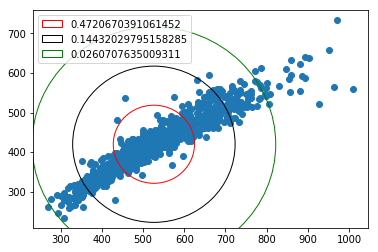

$\qquad$ $\qquad$$\qquad$  **TDA 231 Machine Learning: Homework 1** <br />
$\qquad$ $\qquad$$\qquad$ **Goal: Introduction to Probability,  MLE and Jupyter python Notebook**<br />
$\qquad$ $\qquad$$\qquad$                   **Grader: Aristide, Vasileios** <br />
$\qquad$ $\qquad$$\qquad$                     **Due Date: 08 April** <br />
$\qquad$ $\qquad$$\qquad$                   **Submitted by: Adam Olsson, 950418-xxxx, adaolss@student.chalmers.se** <br />

General guidelines:
* All solutions to theoretical and pratical problems must be submitted in this ipynb notebook, and equations wherever required, should be formatted using LaTeX math-mode.
* All discussion regarding practical problems, along with solutions and plots should be specified in this notebook. 
All plots/results should be visible such that the notebook do not have to be run. But the code in the notebook should reproduce the plots/results if we choose to do so.
* Your name, personal number and email address should be specified above.
* All tables and other additional information should be included in this notebook.
* ** Before submitting, make sure that your code can run on another computer. That all plots can show on another computer including all your writing. It is good to check if your code can run here: https://colab.research.google.com **

**Jupyter/IPython Notebook** is a collaborative Python web-based environment. This will be used in all our Homework Assignments. It is installed in the halls ES61-ES62, E-studio and MT9. You can also use google-colab: https://colab.research.google.com
to run these notebooks without having to download, install, or do anything on your own computer other than a browser.
Some useful resources:
1. https://jupyter-notebook-beginner-guide.readthedocs.io/en/latest/ (Quick-start guide)
2. https://www.kdnuggets.com/2016/04/top-10-ipython-nb-tutorials.html
3. http://data-blog.udacity.com/posts/2016/10/latex-primer/ (latex-primer)
4. http://jupyter-notebook.readthedocs.io/en/stable/examples/Notebook/Working%20With%20Markdown%20Cells.html (markdown)

# Theoretical problems

## [Bayes Rule, 2 points]

After your yearly checkup, the doctor has bad news and good news. The
bad news is that you tested positive for a very serious cancer and
that the test is 99.2% accurate i.e. the probability of testing
positive given you have the disease is 0.992. The probability of
testing negative if you don’t have the disease is the same. The good news is that it is a very rare condition affecting only 1 in 12,000 people. What is the probability you actually have the disease? (Show all calculations and the final result.)

## [Correlation and Independence, 2 points]

Let $X$ be a continuous random variable, uniformly distributed in $[-2, +2]$ and let $Y := X^4$. Clearly $Y$ is not independent of $X$ -- in fact it is uniquely determined by $X$. However, show that the covariance of $X$ and $Y$ is 0: $\mbox{cov}(X, Y ) = 0$.
Show and justify every step of the proof. Statements like "it is obvious that, it is trivial ..." will not be accepted.

## [Setting hyperparameters, 2 points]

Suppose $\theta$ is a random variable generated from a beta distribution as: $\theta \sim \mbox{Beta}(2a,b)$. Also assume that  the expectation of $\theta$ is $m$: $E[\theta] = m$
and the variance of $\theta$ is v: $\mbox{var}(\theta) = v$. Express $a$ and $b$ in term of (only) $m$ and $v$.
For more information about $\mbox{Beta}(2a,b)$ see https://en.wikipedia.org/wiki/Beta_distribution.

Write Answers  here. Double-click (or enter) to edit. Latex mathematical expressions can just be written by starting with "$" and ending with the same character.

## Bayes Rules
$P(A \mid B) = \frac{P(B\mid A)*P(A)}{P(B)}$

A:= Probability of having the disease;  B:= Probaility if a positive test


As defined in the text:

$P(A) = \frac{1}{12000} \Rightarrow P(\overline A) = \frac{11999}{12000}$

$P(B \mid A) = 0.992$ 

$P(\overline B \mid \overline A) = 0.992 \Rightarrow P(B \mid \overline A) = 0.008$ 

Solving for $P(A \mid B)$:

$ P(A \mid B) = \frac{P(B\mid A)*P(A)}{P(B)} = \frac{P(B\mid A)*P(A)}{P(A)*P(B \mid A) + P(\overline A)*P(B \mid \overline A)} = \frac{0.992*\frac{1}{12000}}{\frac{1}{12000}*0.992 + \frac{11999}{12000}*0.008} \approx 1\%$

## Correlation
$ X \sim unif(-2,2)$

$ Y := X^4$

Probability density function of a uniform distribution $uni(a,b): f(x) = \frac{1}{b-a}$ if $-2 \leq x \leq 2 $ otherwise $f(x) = 0$

$f(x) = \frac{1}{2-(-2)} = \frac{1}{4}$ if $x \sim uni(-2,2)$

$\sigma(X,Y) = \sigma(X, X^4) = E(X*X^4) - E(X)*E(X^4) = E(X^5) - E(X)*E(X^4)$

$E(X) = \int_{a}^{b} X f(X) dX = \int_{-2}^{2} X \frac{1}{4} dX = \frac{1}{4} \int_{-2}^{2} X dX = \frac{1}{4}(\frac{2^2}{2}-\frac{(-2)^2}{2}) = 0 \rightarrow E(X) = 0$

$Z := X^5$,  $Z \sim uni(-2^5, 2^5) = uni(-32,32)$

$Z \sim uni(-32,32) \Rightarrow f(z) = \frac{1}{32-(-32)} = \frac{1}{64}$ if $-32 \leq z \leq 32 $ otherwise $f(z) = 0$

$E(Z) = \int_{a}^{b} Z f(Z) dZ = \int_{-32}^{32} Z \frac{1}{64} dZ = \frac{1}{64} \int_{-32}^{32} Z dZ = \frac{1}{64}(\frac{32^2}{2}-\frac{(-32)^2}{2}) = 0 \rightarrow E(Z) = 0$

$\sigma(X,Y) = E(X^5) - E(X)*E(X^4) = E(Z) - E(X)*E(X^4) = 0 - 0*E(X^4) = 0$

$\sigma(X,Y) = 0$


## Setting hyperparameters

$\theta \sim Beta(\alpha, \beta)$, $\alpha = 2a$, $\beta = b$ ,$E(\theta) = m$, $Var(\theta) = v$

$E(\theta) = \frac{\alpha}{\alpha + \beta}$ per def $\Rightarrow m = \frac{2a}{2a + b}$

$Var(\theta) = \frac{\alpha*\beta}{(\alpha + \beta)^2*(\alpha + \beta + 1)}$ per def $\Rightarrow v = \frac{2a*b}{(2a+b)^2*(2a + b +1)}.$

Expressing a & b using m & v:

$m = \frac{2a}{2a + b} \Rightarrow 2am + bm = 2a \Rightarrow bm = 2a - 2am \Rightarrow \frac{bm}{2(1-m)} = a.$

$a = \frac{bm}{2(1-m)}$

$v = \frac{2a*b}{(2a+b)^2*(2a + b +1)} = 
\frac{2(\frac{bm}{2(1-m)})*b}{(2(\frac{bm}{2(1-m)})+b)^2*(2(\frac{bm}{2(1-m)}) + b +1)} = 
\frac{\frac{bbm}{(1-m)}}{(\frac{bm}{1-m}+b)^2*(\frac{bm}{1-m} + b +1)} = 
\frac{\frac{b^2m}{(1-m)}}{(\frac{bm +b(1-m)}{1-m})^2*(\frac{bm}{1-m} + b +1)} = 
\frac{\frac{b^2m}{(1-m)}}{(\frac{bm +b - bm)}{1-m})^2*(\frac{bm}{1-m} + b +1)} = 
\frac{\frac{b^2m}{(1-m)}}{(\frac{b}{1-m})^2*(\frac{bm}{1-m} + b +1)} = 
\frac{\frac{b^2m}{(1-m)}}{\frac{b^2}{(1-m)^2}*(\frac{bm}{1-m} + b +1)} = 
\frac{m}{\frac{1}{(1-m)}*(\frac{bm}{1-m} + b +1)} =  
\frac{m}{\frac{1}{(1-m)}*(\frac{bm + b(1-m) + 1(1-m)}{1-m})} = 
\frac{m}{\frac{1}{(1-m)}*(\frac{bm + b - bm + 1-m}{1-m})} = 
\frac{m}{\frac{1}{(1-m)}*(\frac{b + 1-m}{1-m})} = 
\frac{m}{\frac{b + 1-m}{(1-m)^2}} = 
\frac{m*(1-m)^2}{b + 1-m}.$

$v = \frac{m*(1-m)^2}{b + 1-m} \Rightarrow
v*(b + 1 - m)= m*(1-m)^2 \Rightarrow
vb + v - vm = m*(1-m)^2 \Rightarrow 
vb + v*(1 - m) = m*(1-m)^2 \Rightarrow
b = \frac{ m*(1-m)^2 -  v*(1 - m)}{v}.$

$a = \frac{bm}{2(1-m)}
= \frac{\frac{ m*(1-m)^2 -  v*(1 - m)}{v}m}{2(1-m)}
=\frac{\frac{ m^2*(1-m)^2 -  vm*(1 - m)}{v}}{2(1-m)}
=\frac{\frac{ m^2*(1-m) -  vm}{v}}{2}
=\frac{ m^2*(1-m) -  vm}{2*v} 
=\frac{ m*(-m^2 + m - v)}{2*v}.
$

$\therefore a =\frac{ m*(-m^2 + m - v)}{2*v}$,   $b = \frac{ m*(1-m)^2 -  v*(1 - m)}{v}$

# Practical problems

**Useful python libraries/functions:**
* **General:**  shape, reshape, np.mean etc.
* **Plotting:** plot, scatter, legend, hold, imshow, subplot, grid, title etc. Always show legends for your plots.
* **Code:**  Make sure your code is well commented and variables have intuitive names. Organize your code into functions and comment on the input and output.

## [Spherical Gaussian estimation, 9 points]

Consider a dataset $X$ consisting of i.i.d. observations
generated from a spherical Gaussian distribution $N(\mu, 2\sigma^2I)$, where $\mu \in \mathbb{R}^p$, $I$ 
is the $p \times p $ identity matrix, and $\sigma^2$ is a scalar.

(a) Write the mathematical expression for the Maximum Likelihood Estimator (MLE) for $\mu$ and $\sigma$ in above setup. (HINT: Use latex equations here).

(b) Implement a function **sge(X)** that estimates the mean $\mu$ and variance $\sigma^{2}$ from the given data $X$, using exactly the mathematical expression derived in (a). Note: You cannot use **numpy.cov** and **numpy.mean** or any other functions for calculating the mean and variance. (Hint: A skeleton of this function **sge(X)** is provided in the code from the next cell).

(c) Implement a function **myplot1(X)** which takes as input the dataset $X$; and draws, on the same plot, the following:
1. A scatter plot of the original data $X$, 
2. Circles with center $\mu$ and radius $r=k \sigma$ for $k=1, 2, 3$ where $\mathbf{\mu}$ and $\sigma^{2}$ denote the mean and variance estimated using **sge(X)**. 
3. Legend for each circle indicating the fraction of points (in the original dataset) that lie outside the circle boundary.

(d) Load the dataset from http://bit.ly/2U4CgyW and run your code using only the first two features of the dataset. Submit the resulting plot as well as your implementation here.

For more information about the spherical Gaussian distribution, see https://en.wikipedia.org/wiki/Multivariate_normal_distribution.
For more information about the identity matrix see: https://en.wikipedia.org/wiki/Identity_matrix

Double-click (or enter) to edit. Write Answer to (a) here. Latex mathematical expressions can just be written by starting with "$" and ending with the same character.

The pdf for a random variable X $\sim N(\mu, 2{\sigma}^2I)$ is defined as:

$p(x) = \frac{1}{{2\pi}^{\frac{D}{2}}{\mid\sum\mid}^{\frac{1}{2}}}\exp({\frac{-1}{2}{(X-\mu)}^T{\sum}^{-1}(X-\mu)})$

Where X an observings with having D features and $\sum = 2{\sigma}^2I$. Since we are after the joint probability we will define the loss functions as:

$L = \prod_{n=1}^{N} p(x)$

Where N is the number of observings. To get an expression of $\sigma$ and $\mu$ we take the natural logarithm of the loss function:

$ln(L) = ln(\prod_{n=1}^{N} p(x))=$
$ln(\prod_{n=1}^{N} \frac{1}{{2\pi}^{\frac{D}{2}}{\mid\sum\mid}^{\frac{1}{2}}} \exp(\frac{-1}{2}{(X_{n}-\mu)}^T{\sum}^{-1}(X_{n}-\mu)) =$


$\sum_{n=1}^{N} ln(\frac{1}{{2\pi}^{\frac{D}{2}}}* \frac{1}{\mid\sum\mid^{\frac{1}{2}}}) - \frac{1}{2}{(X_{n}-\mu)}^T{\sum}^{-1}(X_{n}-\mu) =$


$-Nln({2\pi}^{\frac{D}{2}}) - Nln(\mid\sum\mid^{\frac{1}{2}}) - \frac{1}{2}\sum_{n=1}^{N}{(X_{n}-\mu)}^T{\sum}^{-1}(X_{n}-\mu) =$


$-Nln({2\pi}^{\frac{D}{2}}) - \frac{N}{2}ln(\mid\sum\mid) - \frac{1}{2}\sum_{n=1}^{N}{(X_{n}-\mu)}^T{\sum}^{-1}(X_{n}-\mu) =$


$-Nln({2\pi}^{\frac{D}{2}}) - \frac{N}{2}ln(\prod_{d=1}^{D} {2\sigma}^2) - \frac{1}{2}\sum_{n=1}^{N}{(X_{n}-\mu)}^T{\sum}^{-1}(X_{n}-\mu) =$


$-Nln({2\pi}^{\frac{D}{2}}) - \frac{N}{2}\sum_{d=1}^{D} ln({2\sigma}^2) - \frac{1}{2}\sum_{n=1}^{N}{(X_{n}-\mu)}^T{\sum}^{-1}(X_{n}-\mu) =$

$-Nln({2\pi}^{\frac{D}{2}}) - \frac{N}{2}D(ln(2) + ln(\sigma^2)) - \frac{1}{2}\sum_{n=1}^{N}{(X_{n}-\mu)}^T{\sum}^{-1}(X_{n}-\mu) =$

$-Nln({2\pi}^{\frac{D}{2}}) - \frac{N}{2}Dln(2) + NDln(\sigma) - \frac{1}{2}\sum_{n=1}^{N}{(X_{n}-\mu)}^T{\sum}^{-1}(X_{n}-\mu)$

The last term $\frac{1}{2}\sum_{n=1}^{N}{(X_{n}-\mu)}^T{\sum}^{-1}(X_{n}-\mu)$ can be expanded to:
$\frac{1}{2}\sum_{n=1}^{N}{(X_{n}-\mu)}^T{\sum}^{-1}(X_{n}-\mu) = $
$\frac{{(X_{1}-\mu)}^T(X_{1}-\mu)}{\sum} + \frac{{(X_{2}-\mu)}^T(X_{2}-\mu)}{\sum} + ... + \frac{{(X_{N}-\mu)}^T(X_{}-\mu)}{\sum} =$
$\frac{1}{\sum}({(X_{1}-\mu)}^T(X_{1}-\mu) + {(X_{2}-\mu)}^T(X_{2}-\mu) + ... + {(X_{N}-\mu)}^T(X_{N}-\mu))$

Inserting this into our $ln(L)$ expression, we finally get:

$-Nln({2\pi}^{\frac{D}{2}}) - \frac{N}{2}Dln(2) + NDln(\sigma) - \frac{1}{2\sum}\sum_{n=1}^{N}{(X_{n}-\mu)}^T(X_{n}-\mu) = $
$-Nln({2\pi}^{\frac{D}{2}}) - \frac{N}{2}Dln(2) + NDln(\sigma) - \frac{1}{4{\sigma}^2}\sum_{n=1}^{N}{(X_{n}-\mu)}^T(X_{n}-\mu) $

$ln(L) = -Nln({2\pi}^{\frac{D}{2}}) - \frac{N}{2}Dln(2) + NDln(\sigma) - \frac{1}{4{\sigma}^2}\sum_{n=1}^{N}{(X_{n}-\mu)}^T(X_{n}-\mu)$

The derivative w.r.t $\mu$:

$\frac{\partial ln{L}}{\partial \mu} =$
$\frac{\partial}{\partial \mu} \frac{1}{4{\sigma}^2}\sum_{n=1}^{N}{(X_{n}-\mu)}^T(X_{n}-\mu) = $

$\frac{\partial}{\partial \mu} \frac{1}{4{\sigma}^2}({(X_{1}-\mu)}^T(X_{1}-\mu) + ... {(X_{N}-\mu)}^T(X_{N}-\mu))  =$
$\frac{\partial}{\partial \mu} \frac{1}{4{\sigma}^2}({[x_{11}-\mu ... x_{1D}-\mu]}^T[x_{11}-\mu \ ... \ x_{1D}-\mu] + ... {[x_{N1}-\mu ... x_{ND}-\mu]}^T[x_{N1}-\mu ... x_{ND}-\mu])  =$
$\frac{\partial}{\partial \mu} \frac{1}{4{\sigma}^2}({[(x_{11}-\mu)^2 ... (x_{1D}-\mu)^2]} + ... + {[(x_{N1}-\mu)^2 ... (x_{ND}-\mu)^2]})  =$

$\frac{\partial}{\partial \mu} \frac{1}{4{\sigma}^2}\sum_{n=1}^{N}{(X_{n}-\mu)}^2 = \frac{1}{2{\sigma}^2}\sum_{n=1}^{N}{(X_{n}-\mu)}$

Solving for $\mu = 0$:

$\frac{1}{2{\sigma}^2}\sum_{n=1}^{N}{(X_{n}-\mu)} = 0 \Rightarrow$

$\sum_{n=1}^{N}(X_{n})-N\mu = 0 \Rightarrow$

$\sum_{n=1}^{N}(X_{n}) = N\mu \Rightarrow$

$\mu = \frac{1}{N}\sum_{n=1}^{N}(X_{n})$

Taking the derivative w.r.t $\sigma$:

$\frac{\partial ln(L)}{\partial \sigma} = -\frac{ND}{\sigma} + \frac{1}{2\sigma^3}\sum_{n=1}^{N}{(X_{n}-\mu)}^T(X_{n}-\mu)$

Solving for $\sigma = 0$:

$ -\frac{ND}{\sigma} + \frac{1}{2\sigma^3}\sum_{n=1}^{N}{(X_{n}-\mu)}^T(X_{n}-\mu) = 0 \Rightarrow$

$ \frac{1}{2\sigma^3}\sum_{n=1}^{N}{(X_{n}-\mu)}^T(X_{n}-\mu) = \frac{ND}{\sigma} \Rightarrow$

$ \frac{1}{2}\sum_{n=1}^{N}{(X_{n}-\mu)}^T(X_{n}-\mu) = ND\sigma^2 \Rightarrow$

$ \frac{1}{2ND}\sum_{n=1}^{N}{(X_{n}-\mu)}^T(X_{n}-\mu) = \sigma^2 \Rightarrow$

$ \sigma = \sqrt{\frac{1}{2ND}\sum_{n=1}^{N}{(X_{n}-\mu)}^T(X_{n}-\mu)}$

$\therefore \mu = \frac{1}{N}\sum_{n=1}^{N}(X_{n}),\quad \sigma = \sqrt{\frac{1}{2ND}\sum_{n=1}^{N}{(X_{n}-\mu)}^T(X_{n}-\mu)}$


```python
# Sample Answer to (b)
import numpy as np # numpy


def sge(X):
    """
    This function computes the  mean and variance estimator for a spherical Gaussian distribution

    @param X : A numpy array of size n x p where each row represents a p-dimensional data point
    e.g. X = [ [2, 1], [3, 7], [4 ,5] ] is a dataset with 3 samples having two coordinates each.
    @return mu: A numpy array of size p representing the estimated mean of the dataset
    @return sigma: A real number indicating the estimated standard deviation of the dataset
    """
    #mu = np.zeros(X.shape[1])

    (noObservings, features) = X.shape
    
    # Get the mean for each feature
    mu = np.zeros(features)
    for obs in range(noObservings):
        mu = mu + X[obs,:]
    mu = mu/noObservings
    
    # Get the variance for the total data set
    s = 0
    for obs in range(noObservings):
        s = s + np.dot((X[obs,:] - mu).transpose(),(X[obs,:] - mu))
    
    sigma2 = (1/(2*noObservings*features))*s
    sigma = np.sqrt(sigma2)
    
    return mu, sigma
```


```python
# Sample Answer to (c) and (d)
# Make it possible to show plots in the notebooks.
%matplotlib inline
import numpy as np
import matplotlib
import matplotlib.pyplot as plt # for plots

def euclidianDistance(p1, p2):
    return np.sqrt(np.square(p1[0] - p2[0]) + np.square(p1[1]-p2[1]))

# Sample code
def myplot1(X):
    """
    *TODO* Add description of the function here.

    @param X : A numpy array of size n x p where each row represents a p-dimensional data point
    """

    #plt.plot(X); # Adding ; to avoid  this function to output things like: "[<matplotlib.lines.Line2D at 0x7fb0551e1630> ..."
    (mu, sigma) = sge(X)
    (noObservings, features) = X.shape
    
    # count number of points outside of circle
    n1 = 0
    n2 = 0
    n3 = 0
    # radius of circles
    r1 = np.sqrt(2)*sigma*1
    r2 = np.sqrt(2)*sigma*2
    r3 = np.sqrt(2)*sigma*3
    for obs in range(noObservings):
        d = euclidianDistance((mu[0], mu[1]), (X[obs,0], X[obs,1]))
        if d > r1:
            n1 = n1+1
        if d > r2:
            n2 = n2+1
        if d > r3:
            n3 = n3+1
    
    # percentage of points outside circles
    frac1 = n1/noObservings
    frac2 = n2/noObservings
    frac3 = n3/noObservings
    
    # plot
    plt.scatter(X[:,0], X[:,1])
    
    circle1 = plt.Circle((mu[0], mu[1]), r1, fill=False, label=frac1, color='red')
    circle2 = plt.Circle((mu[0], mu[1]), r2, fill=False, label=frac2, color='black')
    circle3 = plt.Circle((mu[0], mu[1]), r3, fill=False, label=frac3, color='green')
    
    plt.gcf().gca().add_artist(circle1)
    plt.gcf().gca().add_artist(circle2)
    plt.gcf().gca().add_artist(circle3)
    
    plt.legend(handles=[circle1, circle2, circle3])
    

# Load the dataset
dataset_source = np.DataSource().open('http://bit.ly/HW1_2019')
X = np.loadtxt(dataset_source)

# Plot. TODO Make sure to only plot the first two features.
myplot1(X)
```

    [526.37988827 419.97486034 355.04841713 427.95251397 656.41247672
     528.62011173 446.42271881 536.4972067  102.40223464  77.62290503
      73.17411546  13.41061453]
    69.72688142484063
    (1074, 12)





```python

```
